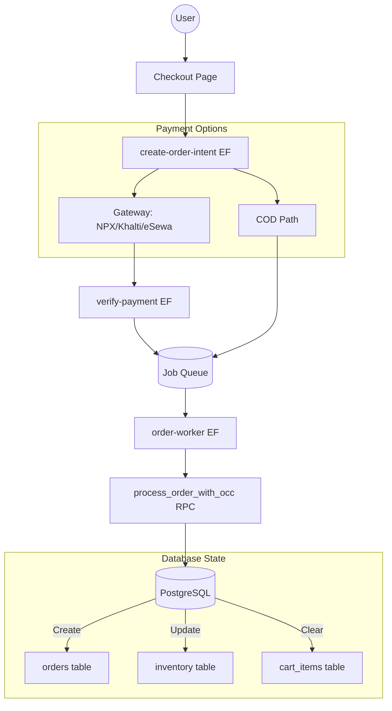

# Architecture Map: KB Stylish Commerce Engine

## Current Payment Flow (Gateway-based)
1. **Frontend**: `CheckoutClient` gathers data and calls `create-order-intent` Edge Function.
2. **Edge Function (`create-order-intent`)**:
   - Validates cart and address.
   - Calculates total.
   - Initiates payment with provider (eSewa, Khalti, NPX).
   - Creates `payment_intents` record (status: `pending`).
   - Calls `reserve_inventory_for_payment` RPC (marks `inventory.quantity_reserved`).
3. **Gateway Redirect**: User pays at the external gateway.
4. **Callback/Verification**:
   - User returns to `/payment/callback`.
   - Frontend calls `verify-payment` Edge Function.
   - `verify-payment` checks status with gateway API.
   - If successful, updates `payment_intents` (status: `succeeded`) and enqueues `finalize_order` job.
5. **Background Processing**:
   - `order-worker` picks up job.
   - Calls `process_order_with_occ` RPC.
   - `process_order_with_occ` creates `orders` and `order_items`, updates `inventory` (move from `reserved` to `quantity_available` decrease), and clears cart.

## Proposed COD Flow
1. **Frontend**: Enable "Cash on Delivery" in `CheckoutClient`.
2. **Edge Function (`create-order-intent`)**:
   - If `payment_method === 'cod'`:
     - Skip gateway initiation.
     - Create `payment_intents` record (status: `succeeded` or `cod_confirmed`).
     - Call `reserve_inventory_for_payment` RPC.
     - **CRITICAL**: Enqueue `finalize_order` job IMMEDIATELY.
3. **Frontend**: Redirect to success page without waiting for verification.

## Data Flow Diagram (Mermaid)

## Security & Integrity Patterns
- **Dual-client pattern**: Edge functions use user client for auth and service client for DB.
- **Atomic RPCs**: All state changes are wrapped in PostgreSQL functions with transactional integrity.
- **Inventory Reservation**: Prevents race conditions during the payment window.
- **Idempotency**: `job_queue` uses `idempotency_key` based on transaction ID.
