# 📚 PHASE 1: CODEBASE IMMERSION - FINAL PRODUCTION CERTIFICATION
**Date**: October 20, 2025  
**Protocol**: Universal AI Excellence v2.0  
**Objective**: Complete investigation of scheduling system for enterprise-grade certification

---

## 🎯 USER REQUIREMENTS

### 1. **SLOT_UNAVAILABLE Error UX** (Image 1)
- **Issue**: After adding booking to cart, user clicks "Change" or tries to rebook
- **Current**: Shows raw error "Unrecognized exception condition 'SLOT_UNAVAILABLE'"
- **Need**: Better UX - block the slot or show user-friendly message

### 2. **Schedule Persistence Model** (Image 3)
- **Question**: What happens after the week is over?
- **Question**: Admin onboards stylist on Tuesday - how much time is allocated?
- **Question**: When does schedule expire? Does it need to be reset weekly?
- **Question**: Client sees 14 days (2 weeks) - how is this calculated?

### 3. **Dropdown UI Issue** (Images 4, 5)
- **Issue**: Schedule override page dropdown has white background
- **Problem**: Text not visible due to white-on-light
- **Need**: Fix background to match dark theme consistency

### 4. **Comprehensive Override Testing**
- **Need**: Verify ALL override types work:
  - Business Closure (all stylists, full day)
  - Stylist Vacation (one stylist, full day)
  - Seasonal Hours (all stylists, modified hours)
  - Special Event (variation testing)
- **Need**: Test all date ranges, time ranges, priority conflicts

### 5. **Schedule Edit Functionality**
- **Issue**: No edit button for existing schedules (line 110 shows "Edit (Coming Soon)")
- **Need**: Admins should be able to edit stylist schedules after creation

---

## 🗺️ SYSTEM ARCHITECTURE MAP

### **Database Schema**

#### `stylist_schedules` Table
```sql
Columns:
- id (uuid)
- stylist_user_id (uuid, FK to stylist_profiles)
- day_of_week (integer, 0-6)  -- 0=Sunday, 6=Saturday
- start_time_utc (time)
- end_time_utc (time)
- start_time_local (time)
- end_time_local (time)
- break_start_time_utc (time, nullable)
- break_end_time_utc (time, nullable)
- break_duration_minutes (integer, nullable)
- is_active (boolean, default true)
- effective_from (date, default CURRENT_DATE)  ⚠️ NOT USED IN get_available_slots!
- effective_until (date, nullable)             ⚠️ NOT USED IN get_available_slots!
- created_at (timestamptz)
- updated_at (timestamptz)

Key Points:
✅ Schedules are RECURRING by day_of_week
✅ Have effective_from/effective_until dates BUT not enforced!
❌ No automatic expiration - schedules persist indefinitely
❌ get_available_slots() doesn't check effective dates!
```

#### `schedule_overrides` Table
```sql
Columns:
- id (uuid)
- override_type (text)  -- business_closure | stylist_vacation | seasonal_hours | special_event
- applies_to_all_stylists (boolean, default false)
- stylist_user_id (uuid, nullable, FK)
- start_date (date)
- end_date (date)
- override_start_time (time, nullable)  -- For modified hours
- override_end_time (time, nullable)
- is_closed (boolean, default false)
- priority (integer, default 0)
- reason (text, nullable)
- created_by (uuid, FK to user_profiles)
- created_at (timestamptz)
- updated_at (timestamptz)

Priority Defaults:
- Business Closure: 100 (highest)
- Stylist Vacation: 50
- Special Event: 30
- Seasonal Hours: 10

Key Points:
✅ Date-ranged (start_date to end_date)
✅ Cache invalidation trigger working (synchronous delete)
✅ Supports both full-day closure and modified hours
✅ Priority-based conflict resolution
```

#### `booking_reservations` Table
```sql
Purpose: Temporary slots held when user adds to cart
- 15-minute TTL
- Status: 'active' | 'cancelled' | 'converted'
- Prevents double-booking during checkout
- Released if user doesn't complete payment
```

---

## 🔍 CRITICAL FINDINGS

### Finding #1: Schedule Persistence Model
**ANSWER**: Schedules are **PERPETUAL** by design!

```sql
-- Schedule Structure:
- Created once per stylist per day_of_week
- Repeats every week FOREVER (or until effective_until date)
- effective_from defaults to CURRENT_DATE
- effective_until can be NULL (infinite)

-- Example: Tuesday schedule created on Oct 20
✅ Applies to: Oct 20, Oct 27, Nov 3, Nov 10... (every Tuesday)
✅ Does NOT need weekly reset
❌ BUT: effective_from/effective_until NOT checked in get_available_slots()!
```

**Impact**:
- ✅ Admin creates schedule once - works forever
- ✅ No weekly maintenance needed
- ❌ effective_from/effective_until dates are ignored by availability function
- ⚠️ If admin sets effective_until, slots still show after that date!

### Finding #2: 14-Day Window Logic
**Location**: Frontend booking modal  
**Calculation**: Today + 14 days

```typescript
// Typical implementation:
const today = new Date();
const endDate = new Date(today);
endDate.setDate(endDate.getDate() + 14);

// For each date in range:
//   - Check if day_of_week has schedule
//   - Fetch available slots
//   - Display to user
```

**Not configurable** - hardcoded 14 days in frontend.

### Finding #3: SLOT_UNAVAILABLE Error Flow

```mermaid
sequenceDiagram
    User->>+Cart: Add booking
    Cart->>+API: createBookingReservation()
    API->>+DB: create_booking_reservation()
    DB-->>-API: reservation_id + expires_at (15 min)
    API-->>-Cart: Success
    Cart->>Cart: Store in cart (localStorage)
    
    User->>Cart: Click "Change" button
    Cart->>+Modal: Open booking modal
    Modal->>Modal: Display same date/service
    User->>Modal: Try to select same slot
    Modal->>+API: createBookingReservation() again
    API->>+DB: Check if slot available
    DB-->>-API: SLOT_UNAVAILABLE (already reserved!)
    API-->>-Modal: Error response
    Modal->>Modal: ❌ Show exception error (BAD UX!)
```



**Problem**: User sees technical error message instead of friendly explanation.

### Finding #4: Dropdown UI Issue

**Location**: `src/components/admin/ScheduleOverridesClient.tsx:357-369`

```tsx
<select
  value={selectedStylistId}
  onChange={(e) => setSelectedStylistId(e.target.value)}
  disabled={isLoading}
  className="w-full rounded-lg border border-white/10 bg-white/5 px-3 py-2 text-sm ring-1 ring-white/10 focus:outline-none focus:ring-2 focus:ring-[var(--kb-primary-brand)] disabled:opacity-50"
>
  <option value="">Choose a stylist...</option>  {/* ❌ WHITE BACKGROUND */}
  {stylists.map((stylist) => (
    <option key={stylist.user_id} value={stylist.user_id}>
      {stylist.display_name} {stylist.title ? `(${stylist.title})` : ''}
    </option>
  ))}
</select>
```

**Issue**: `<option>` elements inherit browser default white background, making text invisible on dark theme.

### Finding #5: Edit Functionality Missing

**Location**: `src/components/admin/ScheduleManagementClient.tsx:109-113`

```tsx
{schedule.has_schedule ? (
  <Button size="sm" variant="outline" disabled>
    <Edit className="w-4 h-4 mr-1" />
    Edit (Coming Soon)  {/* ❌ NOT IMPLEMENTED */}
  </Button>
) : (
  <Button size="sm" onClick={() => handleCreate(schedule)}>
    <Plus className="w-4 h-4 mr-1" />
    Create Schedule
  </Button>
)}
```

**Missing**:
- Edit existing schedule
- Delete schedule
- Deactivate schedule
- View schedule details

---

## 🔄 DATA FLOW ANALYSIS

### 1. **Schedule Creation Flow**
```
Admin → Create Schedule Modal → /api/admin/schedules/create
    ↓
admin_create_stylist_schedule(p_stylist_id, p_schedules jsonb)
    ↓
INSERT INTO stylist_schedules (
  day_of_week, start_time_utc, end_time_utc,
  effective_from = CURRENT_DATE,
  effective_until = NULL  -- Infinite!
)
```

**Behavior**:
- Creates one row per working day
- Days marked "off" not inserted
- Default: Mon-Fri 9am-5pm, Sat-Sun off
- No expiration unless admin sets effective_until

### 2. **Availability Calculation Flow**
```
Frontend → /api/bookings/available-slots
    ↓
get_available_slots(stylist_id, service_id, target_date)
    ↓
1. Check service availability
2. Check schedule_overrides (priority DESC)
3. Get stylist_schedules WHERE day_of_week = DOW(target_date)  ⚠️ No effective_from check!
4. Generate 30-min slots from start to end time
5. Filter out:
   - Past slots
   - Break times
   - Booked slots (+30 min buffer)
   - Reserved slots (+30 min buffer)
   - Override blocked times
```

**Critical Gap**: Never checks `effective_from` or `effective_until`!

### 3. **Override Application Flow**
```
get_available_slots() queries schedule_overrides:

WHERE (stylist_user_id = p_stylist_id OR applies_to_all_stylists)
  AND p_target_date BETWEEN start_date AND end_date
ORDER BY priority DESC, is_closed DESC, stylist_user_id IS NOT NULL DESC
LIMIT 1  -- Highest priority wins

If override.is_closed = TRUE:
  → RETURN immediately (no slots)
  
If override has start_time/end_time:
  → Block slots that overlap with override window
```

**Working correctly** after cache fix!

---

## 📊 OVERRIDE TYPES MATRIX

| Type | Priority | Scope | Use Case | Test Status |
|------|----------|-------|----------|-------------|
| Business Closure | 100 | All stylists | Holidays, maintenance | ✅ TESTED (Dashain) |
| Stylist Vacation | 50 | One stylist | Personal time off | ✅ TESTED (Oct 22) |
| Seasonal Hours | 10 | All stylists | Summer/winter hours | ⏳ NOT TESTED |
| Special Event | 30 | Flexible | Weddings, photo shoots | ⏳ NOT TESTED |

**Variations to Test**:
1. ✅ Full day closure (is_closed = true)
2. ✅ Modified hours (is_closed = false, start_time/end_time set)
3. ⏳ Multi-day range (start_date != end_date)
4. ⏳ Overlapping overrides (priority resolution)
5. ⏳ All stylists vs single stylist
6. ⏳ Past dates (should not show)
7. ⏳ Far future dates (should work)

---

## 🎨 EXISTING PATTERNS

### Error Handling Pattern
```typescript
// Bad (current):
if (error.code === 'SLOT_UNAVAILABLE') {
  throw new Error('Unrecognized exception condition "SLOT_UNAVAILABLE"');
}

// Good (should be):
if (error.code === 'SLOT_UNAVAILABLE') {
  toast.error('This slot is already in your cart or no longer available');
  // Optionally: Close modal, refresh slots
}
```

### UI Pattern for Dropdowns
```tsx
// Theme-aware select pattern (from other components):
<select className="...bg-white/5...">
  <option className="bg-[var(--kb-surface-dark)] text-foreground">...</option>
</select>
```

### Modal Pattern
```tsx
// Standard modal for editing:
<Dialog open={isOpen} onOpenChange={onClose}>
  <DialogContent className="bg-[var(--kb-surface-dark)] border-white/10">
    <DialogHeader>
      <DialogTitle>Edit Schedule</DialogTitle>
    </DialogHeader>
    <form onSubmit={handleSubmit}>...</form>
  </DialogContent>
</Dialog>
```

---

## 🚨 BUGS DISCOVERED

### Bug #1: Effective Dates Not Enforced (P2)
**Impact**: Medium  
**Description**: `effective_from` and `effective_until` in `stylist_schedules` are never checked

**Example**:
```sql
-- Schedule with effective_until = 2025-10-25
INSERT INTO stylist_schedules (..., effective_until = '2025-10-25');

-- Oct 26 query:
SELECT * FROM get_available_slots(..., '2025-10-26');
-- Returns slots! Should return nothing!
```

**Fix Needed**: Add effective date check in `get_available_slots()`

### Bug #2: SLOT_UNAVAILABLE Poor UX (P1)
**Impact**: High  
**Description**: Technical error shown to users when they try to change already-reserved booking

**Fix Needed**: 
1. Detect when user is modifying existing reservation
2. Cancel old reservation before creating new
3. Show user-friendly message on conflict

### Bug #3: Dropdown White Background (P0)
**Impact**: High (blocks admin usage)  
**Description**: Can't see text in stylist dropdown on schedule override page

**Fix Needed**: Add dark theme styles to `<option>` elements

### Bug #4: No Edit Functionality (P2)
**Impact**: Medium  
**Description**: Admin cannot edit existing schedules - must delete and recreate

**Fix Needed**: Implement edit modal and API

---

## ✅ PHASE 1 COMPLETE

**Next Steps**:
- Phase 2: Expert Panel Consultation
- Phase 3: Solution Blueprint
- Phase 4-10: Implementation → Testing → Certification

**Status**: Ready for Phase 2 ✅
